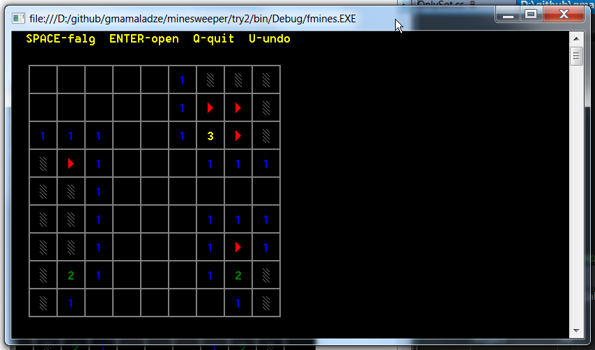

WARNING!
========

If you are a beginner looking for some code to snitch for you second project you are wrong here.
The code will irritate you and none of the snippets you copied will ever work.

Functional Minesweeper in C#
==========================

* Unlike many other mini projects it's fully functional and bug free.
* But it is not about what it does, it's about code.
* The code is written in C#, but in a very functional programming manner - that's what some call "functionalish".

This project is basically useless without explanation, but I doubt I will find time to write down anything.