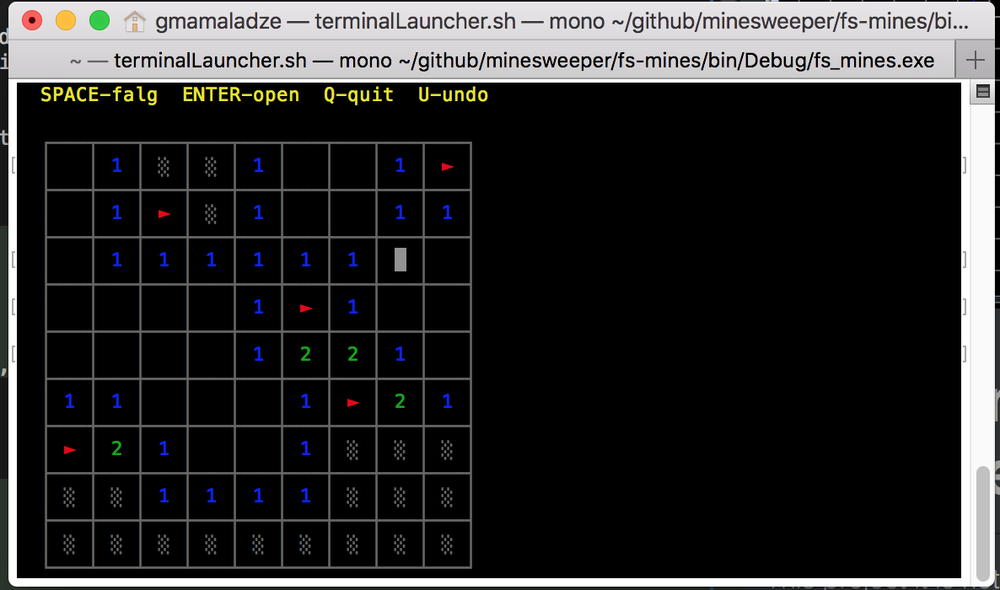

Functional Minesweeper in C#
==========================

This project it is not about what it does, it's about code.
The code of the first implementation is written in **C#**, but in a very functional programming manner - that's what some call "functionalish".

The second implementation is the port of the C# implementation into **F#**. Since I tried to stick to the functional paradigm in
the original implementation the port turned out to be just a kind of *"word by word translation"*.

###Example:
```c#
        public GameState Undo()
        {
            var moves = _moves.Pop();
            return moves.IsEmpty
                ? this
                : new GameState(moves, CursorPosition);
        }
```

```f#
    member x.Undo = 
        match x.Moves with
        | [] -> x
        | _ -> 
            { Moves = x.Moves.Tail
              CursorPosition = x.CursorPosition }
```

###Pure functional in C#
This experiment and my expirience showed that now-days you **can** stick to functiona paradigm while using a universal languages like Java or C#.

Beeing functional in C# ...
* ... is doable! 
* ... means you don't have to lern a functional language, you can stay in C# to understand and practice the functional programming paradigm
* ... allows moving towards functional by rewriting non functional code gradually 

, although it ...
* ... is much more verbose
* ... requeres discipline not to "relapse"

These **recommendations** will help you to stay functional in C# while making a switch-over to F# a NOP:
1. Design with right **data structures** - prefer Sequnces (IEnumerable), Maps (Dictionary), Linked Lists (Stack) over Arrays and ILists (C#)
2. Prefer **Pure Functions** see.: [Introduction to Pure Functional Transformations C#](https://docs.microsoft.com/en-us/dotnet/csharp/programming-guide/concepts/linq/introduction-to-pure-functional-transformations)
3. Prefer **LINQ** which easily maps to pipes in F# `|>`.  
4. Avoid nested conditionals (`if else`), instead prefer `? :` operators, `switch case` or type matching which all map to pattern matching in F#. See.: [Pattern Matching in C#](https://docs.microsoft.com/en-us/dotnet/csharp/pattern-matching)
5. Control mutable state by using immutable data structures. See.:[System.Collections.Immutable](https://msdn.microsoft.com/en-us/library/mt452182(v=vs.111).aspx)
6. Use events only when you absolutely have to. If events are your primary data source consider processing them as an event streams. See.: [Reactive-Extensions/Rx.NET](https://github.com/Reactive-Extensions/Rx.NET)
7. Make constructors dumb - use static builder methods.
8. Use simple while loops - they are easier to replace with a recursion.